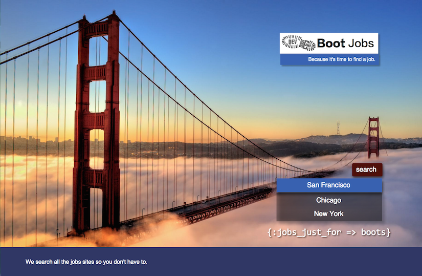
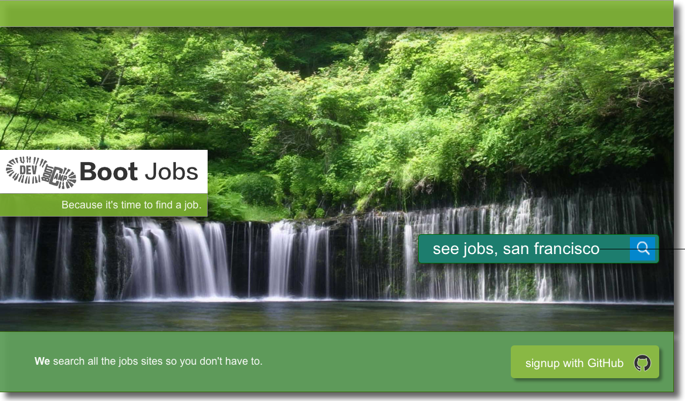
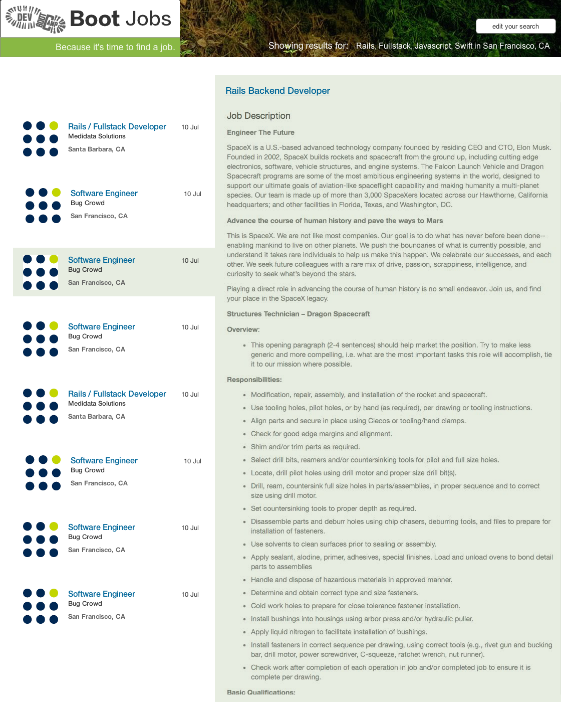
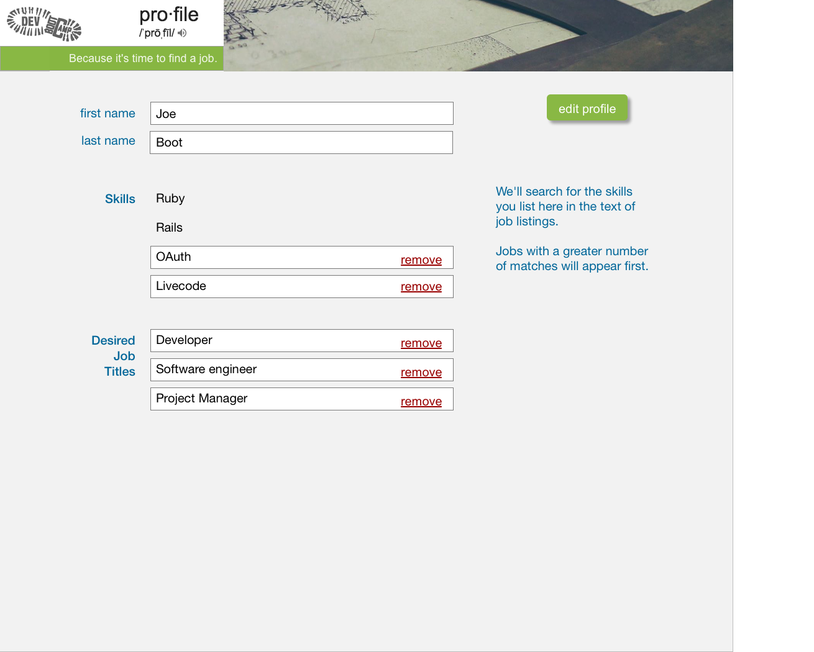
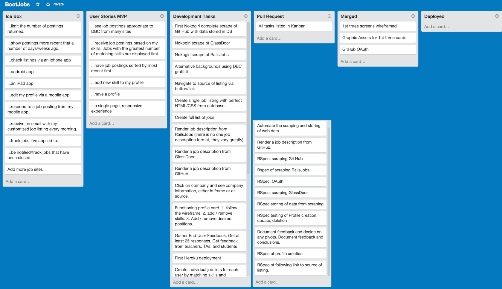
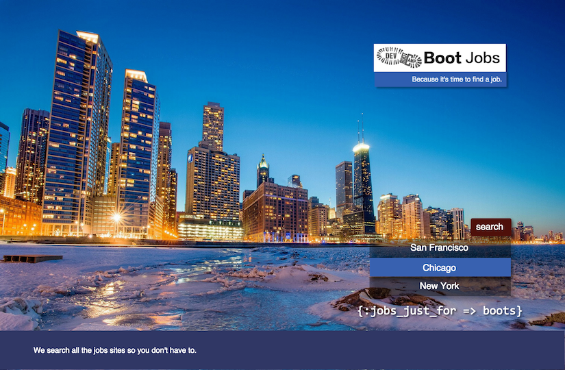
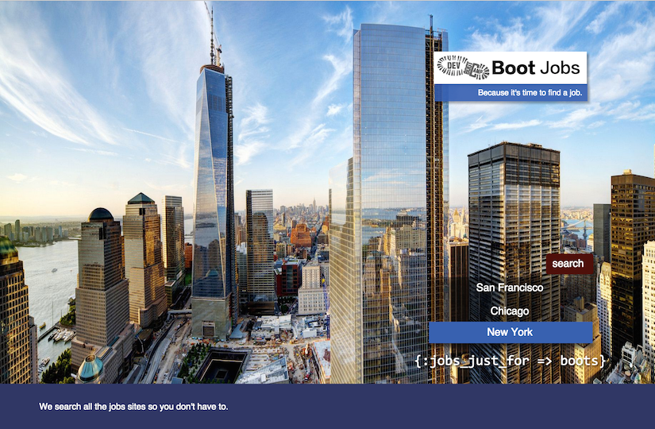

# bootcampjobs

Phase 3 Final Project- 
* Mike Farr
* James Newman
* Karan Aditya
* Henry Vega 

##The Problem
As a job searcher I have to signup, configure and daily monitor several job listing sites, otherwise I risk missing job opportunities I qualify for.  If my situation, skillset, or requirements change I must update all the different sites.

###The Solution
DBC Jobs is a job-searching engine that will API or scrape:
* glassdoor
* Indeed
* simply hired
* stackoverflow jobs
* craigslist jobs
* rails jobs
*  accessing their information to curate a list of potential jobs for DBC graduates: i.e. junior full-stack, rails-based web development in the SF Bay area.

##User Stories - MVP.  As a user I want to...
* ...be able to see all my job listings at one site
* ...be able to see appropriate job listings for a DBC graduate immediately without configuration
* ...be able to add new skills to my profile and be shown additional jobs that I'm now qualified for.
* ...have my job listing sorted most recent first
* ...have jobs that are a better match for me appear before lessor matches

* ...have a "single page", simple, fast experience.* 
* ...authenticate with GitHub since my peers and I all have Git Hub

##User Stories - Stretch.  As a user I want to...
* ...receive an email with my customized job listing every morning
* ...Reviews of companies, interview styles by DBC students and alumni
* ...check job postings via smartphone
* ...respond to job postings from my phone
* ...Integrate with existing DBC career software
* ...track "Applied to", "Already taken"

###Priorities for Team Mates
Next we the teamates checked in with each other.  What are our priorities and heart felt goals for the project.

1. Mike-- Make something useful and beautiful that our friends can benefit from in the next 4 days
2. Hank -- Stay mindful about how everyone is doing during this hard week.
3. Karan- Be professional, hold yourself accountable for being here on time, finishing tasks on time
4. James- Stretch our limits, push ourselves, have an MVP product by the end
 
We agreed to standup morning, noon, and night with each other.  We will pair program on everything.

####Strengths/Weaknesses

1. Mike
 * Strengths: API Consumption, Rails, UI, REST, Mobile, Stamina, the Concept
 * Weakness: haven't used nokogiri before
2. Karan
 * Strength: Project management, Back-end/rails-base
 * Weakness: Front-end, atomic, sass
3. James
 * Strength: Rails, front-end, prestige world-wide
 * Weakness: Rabbit-holing
4. Vega
 * Strength: Front-end, CSS
 * Weakness: Back-end, API consumption

##Thursday Schedule

* 11:15AM - 11:45 AM
 * Discuss schedule and standup times...etc.

* 12:00 PM - 2:00 PM
 * Basic project idea (MVP) + lunch

* 2:00 PM - 2:30 PM
 * Git workflow

* 2:30 PM - 4:30 PM
 * User Stories
 * Wireframing

* 4:30PM - 4:45PM
 * Standup and check-in

* 5:00PM - 6:00PM
 * Research different apps

* 6:00PM
 * End of day standup

* 6:00PM - End of Day
 * Individual research

------------------------------------------

##Friday, July 17, 2015

* 11:00 AM- **Standup (1 min each)**
 * James- Yesterday was good. K and I went through phase 1 nokogiri challenge, get a good feel for nokogiri. Did not write any code.  
 * Getting nokogiri sauce down
* Mike
  * Wireframe for webpages
  * Spoke with Marie about current DBC job sites
* Henry
  * Research on advanced CSS
  * Sass and atomic
  * Coderkit trial for advanced CSS
* Karan
  * Ran through simple nokogiri scraping last night
  * Thought about today's day plan
  * Want to stay positive and on schedule, worked really well yesterday

##Wireframes by Mike
###Home page.  
* One button displays our standard list of DBC compatible jobs.  
* The other is a button to login with github.

###Aggregate job listing.  Clicking on a listing 

###Initial design of our user's profile page

###DBC Jobs  Daily Schedule  Friday July 17, 2015

* 11:00 AM - 11:15 AM
 * Recap of design

* 11:15 AM - 12:30 PM
 * Nokogiri research, wireframe wrap-up

* 12:30 PM - 1:00 PM
 * Lunch

* 1:00 PM - 1:10 PM (2 min each)
 * Check-in

* 1:15 PM - 2:30 PM
 * Basic schema design

* 2:30 PM - 2:45 PM
 * Break

* 2:45 PM - 5:00 PM
 * Nokogiri
 * Migrations and models/Heroku deploy
 * Git workflow

* 5:00 PM - 6:00 PM
 *Engineering Empathy

* 6:00 PM
 * 360 degree feedback
 * Prep

##Kanban Board
This is how we start our project.  
 
.

[Here is the link on Trello](https://trello.com/b/sYYztdxH/bootjobs)
, if you have access to it. 
### The Final Project
The initial screen lets you choose from SF, Chicago, and NYC where Dev Bootcamp runs bootcamps.

The main screen displays a job index from which you can bring up the original job page in an iframe.

###Next on the ToDo list
* Convert from scraping with Nokigiri to API access
* Really add Chicago and NYC
* Sign affiliate agreements with recruiting and job listing companies
* Finish User accounts
* Add user customizable search terms, e.g. add "Ember.js" when that skill is learned, then prioritize by skill matches
